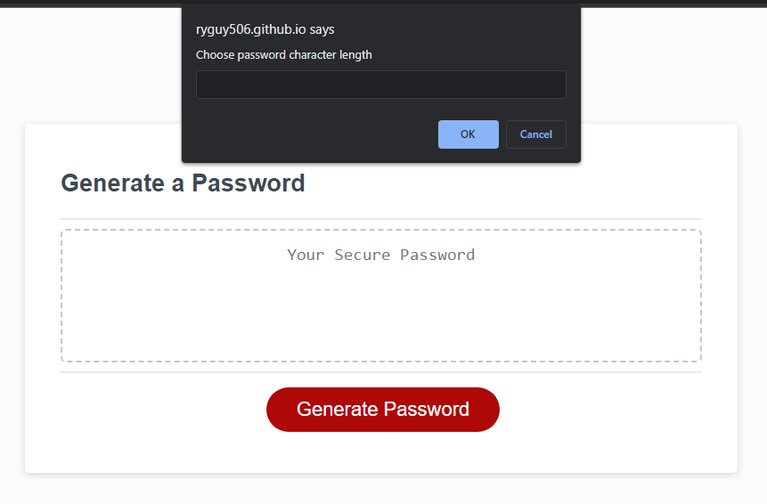
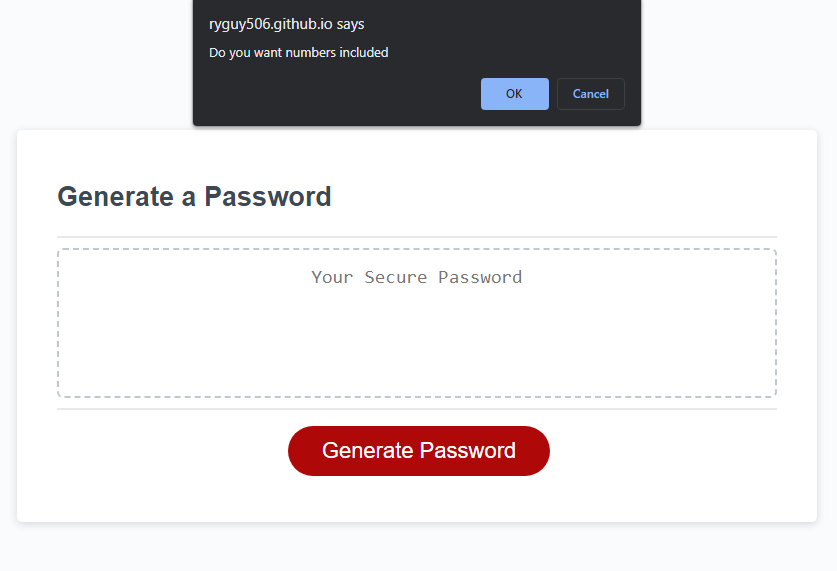
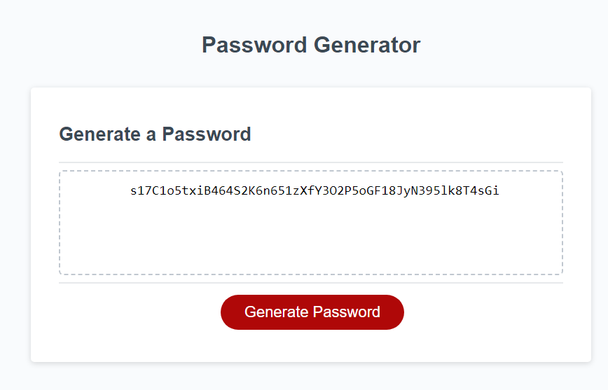
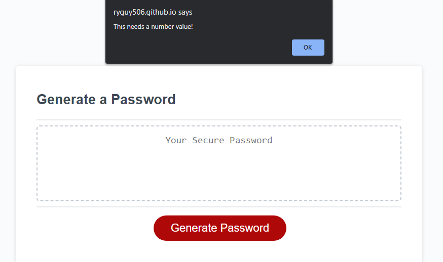
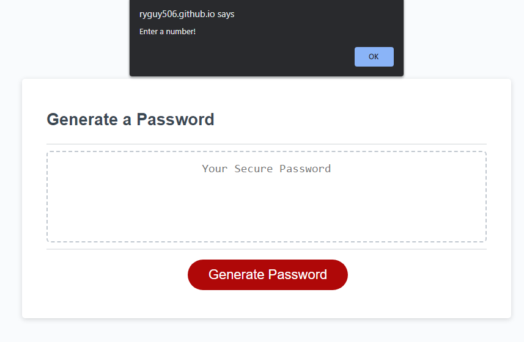
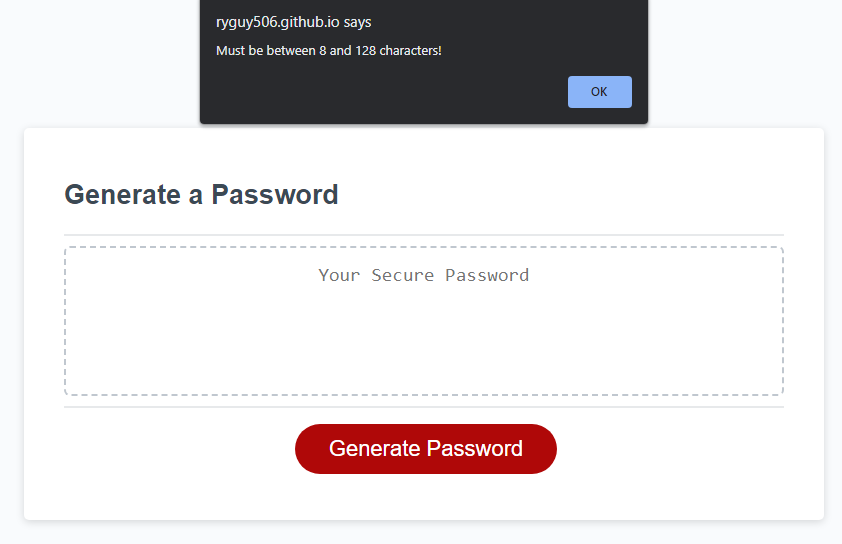
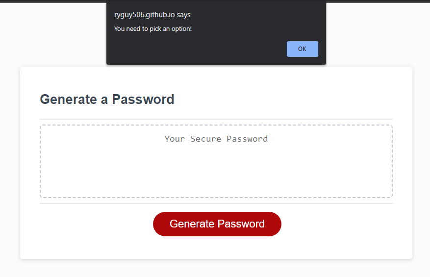

# Password Generator

## Description
This project uses Javascript to generate a random unique password from the users specified choices.

## Usage
https://ryguy506.github.io/password-generator/

 Click the link above to open the page. Once opened click on Generate Password button, a prompt will appear and ask the user to enter password character length.

Then the user will be asked individually if they want Symbols , Numbers , Uppercase or Lowercase included in the password. 

Then the password with the users choices will be displayed.

## Features

if nothing is entered it will alert the user and then ask again to enter password character length.

if the user enters characters that are not a number it will alert the user and then ask again to enter password character length.

if the user enters a password length less than 8 characters or greater than 128 characters it will alert the user and then ask again to enter password character length.
 
 

if the user does not pick aleast 1 option it will alert the user and then ask again to enter password character length.

 
## Credits

The HTML and CSS file was provided by UNB bootcamp GitLab

## License

This code is free to use
